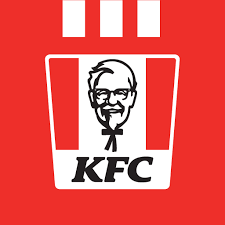

<div align="center">

<br/>
  <h1>
  
  
  
  
  </h1>
</div>

## How To Use 🔧

From your command line, first clone Portfolio:

```bash
# Clone the repository
$ git clone https://github.com/msarimhassan/kfc-mern.git
# Move into the repository
$ cd kfc-mern
# Remove the current origin repository
$ git remote remove origin
```

After that, you can install the dependencies either using NPM or Yarn.

Using NPM: Simply run the below commands.

```bash
# Install dependencies
$ npm install
# Start the development server
$ npm start
```

Using Yarn: Be aware of that you'll need to delete the `package-lock.json` file before executing the below commands.

```bash
# Install dependencies
$ yarn
# Start the development server
$ yarn start
```

## Further Reading / Useful Links 🛠️

-   [Reactjs](https://reactjs.org/)
-   [Nodejs](https://nodejs.org/)
